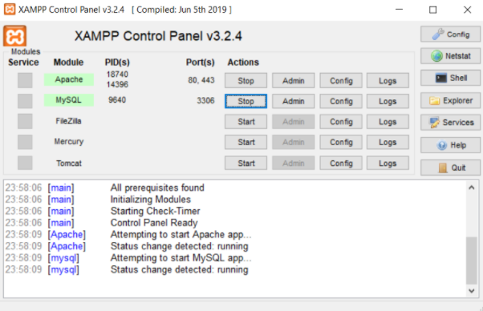
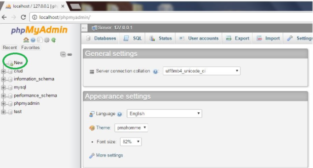
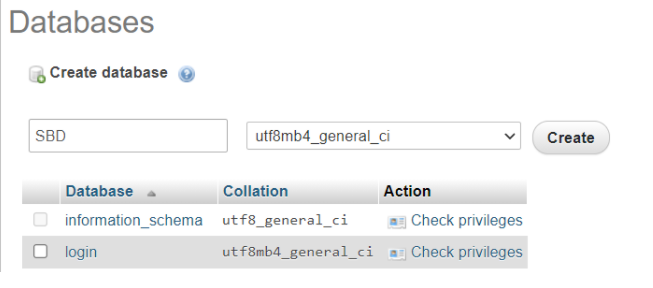
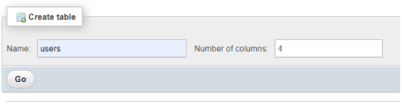
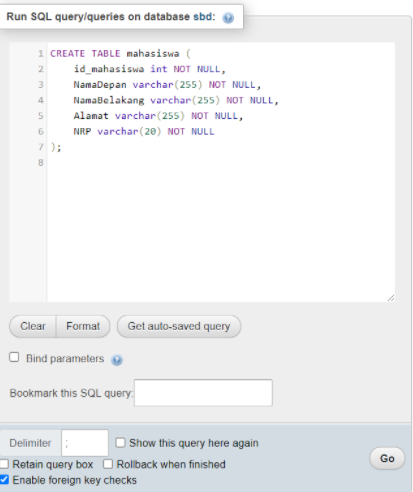
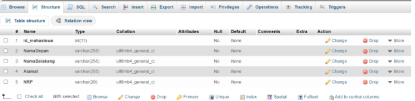

# Data Definition Language (DDL)

## Daftar Isi
- [1. Data Manipulation Language DML](#1-data-manipulation-language-dml)
- [2. Data Definition Language DDL](#2-data-definition-language-ddl)
- [3. Data Control Language DCL](#3-data-control-language-dcl)
- [4. Membuat table](#4-membuat-table)
  - [4.1 Membuat table melalui Console](#41-membuat-table-melalui-console)
  - [4.2 Membuat table melalui UI](42-membuat-table-melalui-ui)
- [5. Constraint table](#5-constraint-table)

Idealnya, bahasa database memungkinkan kita untuk membuat database dan struktur tabel, melakukan tugas manajemen data dasar (menambah, menghapus, dan memodifikasi), serta melakukan query kompleks yang dirancang untuk mengubah data mentah menjadi informasi yang berguna. Selain itu, bahasa database harus melakukan fungsi dasar dengan upaya pengguna yang minimal, dan struktur command dan syntax yang harus mudah dipelajari. Untuk itu, diperlukan sebuah standarisasi dasar sehingga seseorang tidak perlu mempelajari kembali dasar-dasarnya ketika berpindah dari satu RDBMS ke RDBMS lainnya. SQL adalah standar yang memenuhi persyaratan bahasa database yang ideal. Fungsi SQL masuk ke dalam beberapa kategori besar:


## 1. Data Manipulation Language DML
Merupakan bahasa yang digunakan untuk memanipulasi data dari basis data (dalam hal ini berupa tabel). Manipulasi data dapat berupa:
1. Penyisipan / penambahan data baru ke dalam tabel
2. Penghapusan data dari tabel
3. Pengubahan data dari tabelSQL 

| Command |  | Deskripsi |
| ------ | ------ | ------ |
| SELECT |  | Memilih atribut dari baris dalam satu atau lebih tabel atau view |
| | FROM | Menentukan tabel dari mana data harus diambil |
| | WHERE | Membatasi pemilihan baris berdasarkan conditional expression |
| | GROUP BY | baris kelompok yang dipilih berdasarkan satu atau lebih atribut |
| | HAVING | Membatasi pemilihan baris yang dikelompokkan berdasarkan condition |
| | ORDER BY | order baris yang dipilih berdasarkan satu atau lebih atribut |
| INSERT|  | Menyisipkan baris ke dalam tabel |
| UPDATE|  | Memodifikasi nilai atribut dalam satu atau lebih baris tabel |
| DELETE|  | Menghapus satu atau lebih baris dari tabel |
| Comparison operator| =,<,>,<=,>=,<>,!= | Digunakan pada conditional expressions |
| Logical Operators|  | Digunakan pada conditional expressions|
| | BETWEEN | Memeriksa apakah nilai atribut berada dalam rentang|
| | IN | Memeriksa apakah nilai atribut cocok dengan nilai yang terdapat dalam daftar nilai|
| | LIKE | Memeriksa apakah nilai atribut cocok dengan pola string yang diberikan |
| | IS NULL | Memeriksa apakah nilai atribut adalah null|
| | EXISTS | Memeriksa apakah subquery mengembalikan baris|
| | DISTINCT | Batasi nilai ke nilai unik (unique value)|
| Aggregate functions |  | Digunakan dengan SELECT untuk mengembalikan ringkasan matematika pada kolom |
| | COUNT | Mengembalikan jumlah baris dengan nilai bukan nol untuk kolom tertentu|
| | MIN | Mengembalikan nilai atribut minimum yang ditemukan di kolom tertentu|
| | MAX |Mengembalikan nilai atribut maksimum yang ditemukan di kolom tertentu|
| | SUM | Mengembalikan jumlah semua nilai untuk kolom tertentu|
| | AVG | Mengembalikan rata-rata semua nilai untuk kolom tertentu|

<br> 

## 2. Data Definition Language (DDL)
Dalam database SQL biasanya terdiri dari tabel data dan semua data di dalamnya. DDL ini menggambarkan desain basis data secara keseluruhan dan didefinisikan dengan bahasa khusus. Dengan bahasa tersebut kita bisa membuat tabel baru, membuat indeks, mengubah tabel, mengubah struktur tabel, atau menghapus dabel. Hasil dari kompilasi DDL biasanya merupakan kumpulan dari beberapa tabel yang disimpan dalam file khusus yang disebut Kamus Data.

| Command |  | Deskripsi |
| ------ | ------ | ------ |
| CREATE SCHEMA AUTHORIZATION |  | Membuat skema database |
| CREATE TABLE| | Membuat tabel baru dalam skema database pengguna |
| | NOT NULL | Memastikan bahwa kolom tidak akan memiliki nilai nol |
| | UNIQUE | Memastikan bahwa kolom tidak akan memiliki nilai yang duplikat |
| | PRIMARY KEY | Defines a primary key for a table |
| | FOREIGN KEY | Defines a foreign key for a table |
| | DEFAULT | Mendefinisikan nilai default untuk kolom (bila tidak ada nilai yang diberikan) |
| CREATE INDEX | | membuat index untuk tabel |
| CREATE VIEW | | Membuat subset dinamis dari baris dan kolom dari satu atau lebih tabel |
| ALTER TABLE | | Memodifikasi definisi tabel (menambah, memodifikasi, atau menghapus atribut) |
|CREATE TABLE AS | | Membuat tabel baru berdasarkan kueri dalam skema database pengguna |
|DROP TABLE | | Menghapus tabel dan datanya secara permanen |
|DROP INDEX | | Menghapus index secara permanen|
|DROP VIEW | | Menghapus view secara permanen|

<br>

## 3. Data Control Language (DCL)
Perintah kontrol data digunakan untuk mengontrol akses ke objek data, seperti memberikan izin kepada satu pengguna untuk hanya melihat tabel PRODUCT dan memberikan izin kepada pengguna lain untuk mengubah data dalam tabel PRODUCT.

| Command |  | Deskripsi |
| ------ | ------ | ------ |
| GRANT |  |Memberikan izin kepada pengguna untuk mengambil tindakan sistem atau mengakses objek data |
| REVOKE| |Menghapus izin yang diberikan sebelumnya dari pengguna |

<br>

## 4. Membuat table
### <b>4.1 Membuat table melalui Console</b>
Perintah CREATE berfungsi untuk membuat. Dalam PL/SQL perintah CREATE ini dapat membuat tabel baru, indeks, prosedur, fungsi, view, dll. Dalam pembahasan ini akan dibahas mengenai fungsi perintah CREATE untuk membuat table. Adapun penulisan perintah CREATE dituliskan sebagai berikut:
```sql
CREATE TABLE nama_tabel (
	kolom11 tipedata(jumlah) 	Constrain, 
	kolom2 tipedata(jumlah)	Constrain,
	kolom3 tipedata(jumlah)	Constrain,
   ....
);
```

contoh :
```sql
CREATE TABLE mahasiswa (
	id_mahasiswa int NOT NULL,
	NamaDepan varchar(255) NOT NULL,
	NamaBelakang varchar(255) NOT NULL,
	Alamat varchar(255) NOT NULL,
	NRP varchar(20) NOT NULL
);

```
**Membuat tabel berdasarkan tabel yang sudah ada**
Salinan tabel yang ada juga dapat dibuat menggunakan `CREATE TABLE`. Tabel baru mendapatkan definisi kolom yang sama. Semua kolom atau kolom tertentu dapat dipilih jika membuat tabel baru menggunakan tabel yang sudah ada. Tabel baru akan diisi dengan nilai yang ada dari tabel lama.
```sql
CREATE TABLE new_table_name AS
    SELECT column1, column2,...
    FROM existing_table_name
    WHERE ....;
```
contoh :
```sql
CREATE TABLE SistemBasisData AS
SELECT NamaDepan, NamaBelakang, NRP
FROM Mahasiswa;
```
SQL diatas  membuat tabel baru yang disebut "SistemBasisData" (yang merupakan salinan dari tabel "Mahasiswa"): 

<br>

### <b>4.2 Membuat table melalui UI</b>
Berikut merupakan cara untuk membuat table menggunakan GUI XAMPP

**1. Pastikan server XAMPP telah aktif**
<br>

<br>

**2. Lalu ketikkan localhost/phpmyadmin and click enter. Maka akan tampil halaman Seperti ini. Klik New pada navigasi dibagian kiri**
<br>

<br>

**3. Selanjutnya akan tampil seperti ini. Silahkan beri nama database sesuai keinginan. Lalu pilih create.**
<br>

<br>

**4. Pilih database yang telah dibuat sebelumnya. Terdapat  dua opsi untuk membuat tabel yakni bisa menggunakan Structure yang ada atau menggunakan SQL. Jika ingin menggunakan opsi yang pertama, maka kita bisa langsung mengetikkan nama tabel di kolom yang tersedia dan klik tombol GO..**
<br>

<br>

Jika menggunakan SQL, maka pilihlah tombol “SQL” di navigasi atas dan ketikkan syntax yang dibutuhkan sebagai berikut. Lalu klik Go untuk menyimpan.
<br>

<br>

**5. Jika kita kembali ke navigasi stucture di dikiri atas, dan muncul tampilan seperti ini, maka create table sudah berhasil.**
<br>

<br>
<br>
## 5. Constraint table

Pada dasarnya constraint SQL digunakan untuk menentukan aturan untuk data dalam tabel. Constraint ini digunakan untuk membatasi jenis data yang dapat masuk ke dalam tabel. Ini memastikan keakuratan dan keandalan data dalam tabel. Jika ada pelanggaran antara batasan dan tindakan data, tindakan dibatalkan.
Batasan dapat berupa level kolom atau level tabel. Batasan tingkat kolom berlaku untuk kolom, dan batasan tingkat tabel berlaku untuk seluruh tabel.

constraint yang biasa digunakan :

- NOT NULL - Memastikan bahwa kolom tidak boleh memiliki nilai NULL
- UNIQUE - Memastikan bahwa semua nilai dalam kolom berbeda
- PRIMARY KEY- Kombinasi dari  `NOT NULL` dan `UNIQUE`. Secara unik mengidentifikasi setiap baris dalam sebuah tabel
- FOREIGN KEY - Mencegah tindakan yang akan menghancurkan tautan antar tabel
- CHECK - Memastikan bahwa nilai dalam kolom memenuhi kondisi tertentu
- DEFAULT - Menetapkan nilai default untuk kolom jika tidak ada nilai yang ditentukan
- CREATE INDEX - Digunakan untuk membuat dan mengambil data dari database dengan sangat cepat

contoh :
```sql
CREATE TABLE CUSTOMER ( 
CUS_CODE NUMBER PRIMARY KEY, 
CUS_LNAME VARCHAR(15) NOT NULL, 
CUS_FNAME VARCHAR(15) NOT NULL, 
CUS_INITIAL CHAR(1), 
CUS_AREACODE CHAR(3) 	DEFAULT '615' NOT NULL 
CHECK(CUS_AREACODE IN ('615','713','931')),
CUS_PHONE CHAR(8) NOT NULL, 
CUS_BALANCE NUMBER(9,2) DEFAULT 0.00, 
CONSTRAINT CUS_UI1 UNIQUE (CUS_LNAME, CUS_FNAME));
```
Dalam hal ini, atribut `CUS_AREACODE` diberi nilai default '615'. Oleh karena itu, jika baris tabel `CUSTOMER` baru ditambahkan dan pengguna akhir tidak memasukkan kode area, nilai '615' akan dicatat. Juga, kondisi `CHECK` membatasi nilai kode area pelanggan menjadi 615, 713, dan 931; nilai lainnya akan ditolak. Hal yang perlu diingat adalah nilai `default` hanya bisa digunakan saat akan menambahkan baris baru (bukan mengubah baris). Sebaliknya kondisi `check` memvalidasi apakah baris yang ditambahkan atau diubah. Terdapat perintah `CONSTRAINT CUS_UI1` pada `CUS_LNAME` dan `CUS_FNAME` hal ini untuk mencegah 2 nama agar mencegah nama yang sama (Indeks ini hanya menggambarkan proses. Namun masih bisa berkemungkinan memliki nama yang sama)


## Referensi :
1. https://www.w3schools.com/
2. Carlos M. Coronel - Database Systems_ Design, Implementation, & Management-Cengage Learning (2018)
